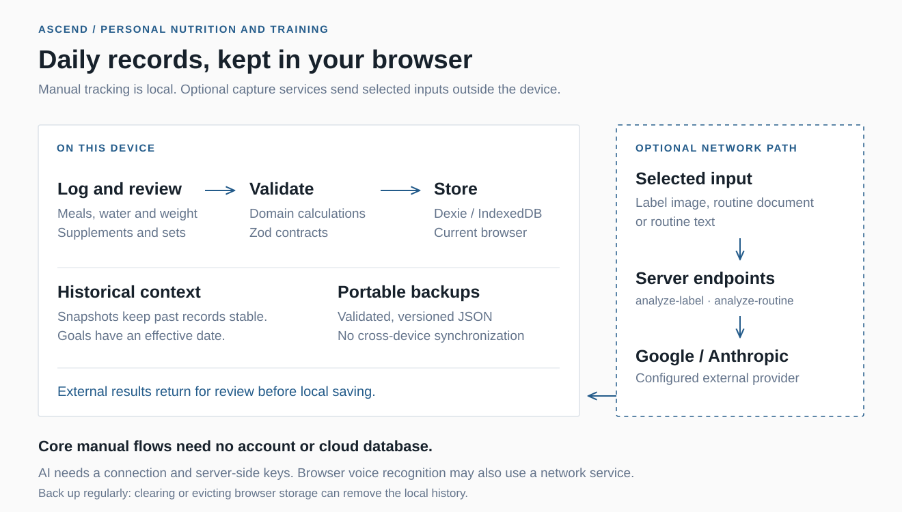

# Ascend

A personal nutrition and training journal that keeps the details of each day together: meals, hydration, supplements, body weight and workout sets. Its history preserves what was recorded at the time, so changing a food or a target does not rewrite past entries.

**React 19 · TypeScript · Dexie / IndexedDB · Zod · Vite PWA**

[Español](./README.es.md) · [Setup](./docs/SETUP.md) · [Limitations](./docs/LIMITATIONS.md)



## Use it day to day

- **Log nutrition:** maintain a food library, create recipes, record portions or grams and reuse meals.
- **Train:** build routines, record weight, reps and RIR for each set, and resume an autosaved session.
- **Review progress:** compare sets over time by routine and exercise, alongside body-weight trends and daily habits.
- **Keep a portable history:** export and import validated, versioned JSON backups.
- **Capture with assistance:** optionally analyze a label image or import a routine from PDF, image or text; review the result before saving. Browser dictation can help enter workout sets.

The interface is in Spanish. This is a personal project by Joshua Corrales, developed around everyday use and still evolving.

## Local data and optional external services

**Manual logging works without an account, an AI key or a cloud database.** Records are stored in the current browser's IndexedDB. There is no cross-device synchronization. Export backups regularly: clearing browser data or storage eviction can remove local history.

The installed PWA supports the main manual flows offline after an initial online load. Two optional features cross that local boundary:

- **AI analysis:** selected label images and routine documents/text are sent to `/api/analyze-label` or `/api/analyze-routine`, then to the configured Google or Anthropic provider. This needs a connection and server-side credentials. Review the extracted values before storing them.
- **Voice dictation:** browser speech recognition may send audio to the browser's recognition service and may require a connection. It does not use the app's Gemini quota.

AI keys belong only in the server environment, without a `VITE_` prefix. Local storage does not make these optional requests private to the device.

## Run locally

Requires Node.js 20 or later and npm; the existing setup guide records validation with Node.js 22.

```bash
npm install
npm run dev
```

Open `http://localhost:5173`. Manual use requires no environment variables.

To enable optional analysis, copy `.env.example` to `.env.local`, set `AI_PROVIDER` and the matching provider key, then restart the development server. The Vite middleware mounts both API handlers locally. Configure model names appropriate to your provider account; the example values are configuration, not an availability guarantee.

For a compiled preview:

```bash
npm run build
npm run preview
```

The preview serves the compiled PWA only. Use `npm run dev` or a Vercel deployment to exercise the AI endpoints. The service worker is disabled in development; check installation and offline behavior with the built app. Full configuration and Vercel setup are in [the setup guide](./docs/SETUP.md).

## Architecture

Feature screens call repository contracts backed by Dexie. Pure domain functions handle calculations; Zod validates critical inputs, backups and external results. Historical entries store snapshots, and nutrition targets have an effective date.

| Location | Responsibility |
| --- | --- |
| `src/app/` | Application composition, navigation and providers. |
| `src/features/` | Nutrition, training, progress and daily tracking screens. |
| `src/lib/domain/` | Calculation and comparison logic. |
| `src/lib/schema/` | Zod contracts and derived types. |
| `src/lib/repositories/` | Data-access contracts and IndexedDB implementations. |
| `src/lib/backup/` | Versioned JSON export and import. |
| `api/` | Optional label and routine analysis handlers. |

Supabase variables in the example configuration are reserved for future work; they do not enable synchronization.

## Verification

```bash
npm run check
```

The command runs TypeScript checks, ESLint, Vitest and the production build. The checked-in tests cover macro calculations, backups, routine import, workout dictation, label capture and per-set progress.

Individual commands are `npm run typecheck`, `npm run lint`, `npm run test` and `npm run build`.

## Documentation

The detailed guides remain in Spanish.

| Guide | Purpose |
| --- | --- |
| [Requirements](./docs/REQUIREMENTS.md) | Product scope and expected behavior. |
| [Decisions](./docs/DECISIONS.md) | Architecture choices and trade-offs. |
| [Data model](./docs/DATA_MODEL.md) | Historical records, snapshots and relationships. |
| [Setup](./docs/SETUP.md) | Local operation, optional AI, installation and deployment. |
| [Limitations](./docs/LIMITATIONS.md) | Storage, offline, voice and accuracy boundaries. |
| [Roadmap](./docs/ROADMAP.md) | Planned work and exclusions. |
| [Nutrition guidance](./docs/nutrition-guidance.md) | Context and references for the guided macro plan. |

Ascend records personal observations; it is not a clinical tool. It does not provide medical recommendations or infer body composition from weight changes.

No license is specified in this repository.
